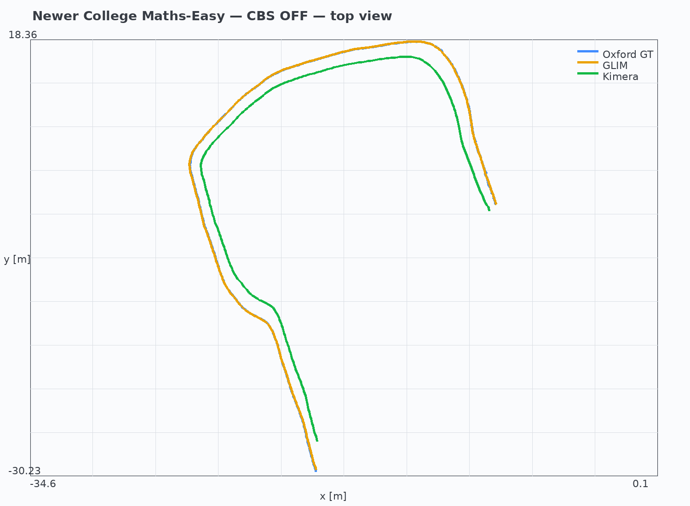
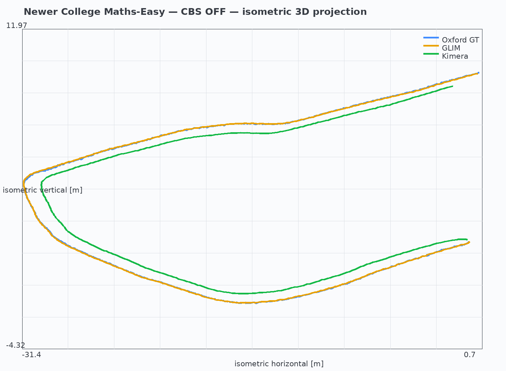
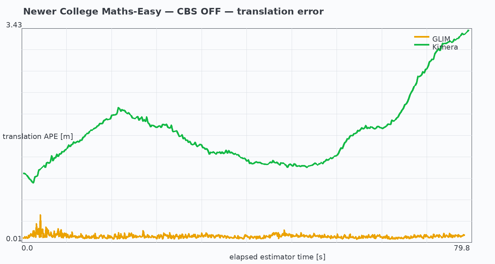

# Maths-Easy — cbs_off

**Status: PILOT**

- Collection: `collection3`
- Release: `2021-ouster-os0-128-alphasense`
- CBS direction: `none`
- Full logical sequence: `false`
- Reported Oxford GT time coverage: `79.798262 s`
- Oxford GT distance over that interval: `98.068428 m`

## Estimator metrics

| Estimator | poses | duration [s] | estimate distance [m] | reference distance [m] | translation APE RMSE [m] |
|---|---:|---:|---:|---:|---:|
| GLIM | 792 | 79.096083 | 91.142401 | 97.722211 | 0.061716 |
| KIMERA | 343 | 79.798262 | 83.520242 | 91.808131 | 1.860251 |

Evaluation uses Oxford Base, one rigid SE(3) alignment per estimator, and scale fixed at one. No Sim(3), time-offset fitting, or trajectory deformation is used.

## Trajectory appearance

## Source

- Source run: `/home/yeranis/repos/V4RL/cbs_gtsam4.3/runs/newer_college_maths_easy_edited_cbs_off_80s_20260821`
- Recording ID: `newer_college_maths_easy_edited_glim_kimera_cbs_off_80s_20260821`
- Exact artifact paths and hashes: `provenance/source_artifacts.tsv`
- Package hashes: `SHA256SUMS`
